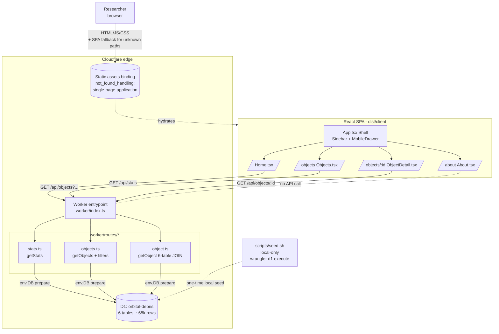

# Architecture

_Last regenerated: 2026-05-23 (end of Phase 4). Regenerate at the end of each phase or when the request flow changes — if this no longer matches the code, something drifted and is worth a 10-minute review._

## Diagram

## How it works

Same backbone as the Phase 3 diagram: one Worker entrypoint, one D1 binding, one static-assets binding with SPA fallback. Phase 4 added an `App.tsx` layout shell (Sidebar on desktop, Headless UI `Dialog` drawer below the `md` breakpoint) that wraps the four route pages. Three of those pages call back to the Worker over `/api/*` for live data; About is fully static and makes no API call. The Worker dispatches `/api/*` paths by `if`/regex into per-route handlers in `worker/routes/*.ts`, each of which queries D1 via `env.DB`. Anything outside `/api/*` falls through to the asset binding, which serves the SPA build and rewrites unknown paths to `index.html` so client-side routes like `/objects/25544` and `/about` resolve into the SPA, which then makes its own `fetch('/api/...')` back to the Worker. Data flows one way: read-only from D1 → JSON → React state.

## Decisions that shaped this

1. **One Worker for API and static assets, not Pages Functions.** The project was bootstrapped on Cloudflare's Workers + Static Assets template (see BUILDPLAN decision log entry 2026-05-14). The Worker is the single entrypoint; the `assets` binding serves the React build. We pay the cost of hand-rolled routing (`if`/regex in `worker/index.ts`) in exchange for one deploy artifact, one set of bindings, and a transparent request path with no framework router in front of it.

2. **Per-route handler files instead of inlining handlers in `worker/index.ts`.** Decided in Phase 1 (decision log 2026-05-20). The entrypoint stays a thin dispatcher; each route's logic lives in `worker/routes/*.ts` and is independently testable via `@cloudflare/vitest-pool-workers` with `SELF.fetch()`.

3. **The object detail endpoint is a single 6-table `LEFT JOIN`, not N+1 fetches.** Decided in Phase 3. One query keeps us inside D1's subrequest budget and lets sparse data (objects missing UCS or launch rows) come back as nulls instead of dropping the satellite. The shared tables (`ownership_operators`, `launch_events`) are joined via string foreign keys on `satellites`, not by `norad_id`, because they're 1-to-many — many satellites share one owner or one launch.

4. **Layout shell (`Sidebar` + `MobileDrawer`) sits inside the SPA, not on the server.** Decided in Phase 4. Nav is pure client-side state, so there's no value in server-rendering it; keeping the shell in `App.tsx` lets `NavLink` drive active state from React Router with no round-trip. `Sidebar` and `MobileDrawer` share their link list via `components/NavLinks.tsx` to prevent drift.
