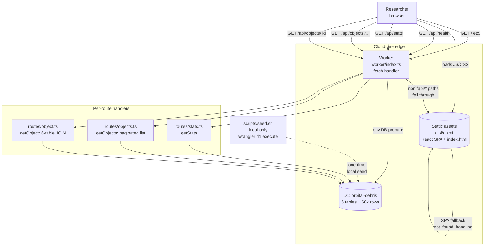

# Architecture

_Last regenerated: 2026-05-23 (end of Phase 3). Regenerate at the end of each phase or when the request flow changes — if this no longer matches the code, something drifted and is worth a 10-minute review._

## Diagram

## How it works

Every HTTP request hits a single Worker entrypoint (`worker/index.ts`) at the Cloudflare edge. The Worker inspects `url.pathname`: anything under `/api/*` is dispatched by `if`/regex into one of three per-route handlers (`stats.ts`, `objects.ts`, `object.ts`), each of which queries the D1 binding `env.DB`. Anything else falls through to the static-asset binding, which serves the built React SPA from `dist/client`. `not_found_handling: "single-page-application"` in `wrangler.jsonc` is the key line — it tells the asset binding to serve `index.html` for unmatched paths, so client-side routes like `/objects/25544` resolve to the SPA, which then makes its own `fetch('/api/objects/25544')` back to the Worker. Data flows one way: read-only from D1 → JSON response → React state. The seed script is a local-machine concern only; production D1 is populated separately and not part of the runtime path.

## Decisions that shaped this

1. **One Worker for API and static assets, not Pages Functions.** The project was bootstrapped on Cloudflare's Workers + Static Assets template (see BUILDPLAN decision log entry 2026-05-14). The Worker is the single entrypoint; the `assets` binding serves the React build. We pay the cost of hand-rolled routing (`if`/regex in `worker/index.ts`) in exchange for one deploy artifact, one set of bindings, and a transparent request path with no framework router in front of it.

2. **Per-route handler files instead of inlining handlers in `worker/index.ts`.** Decided in Phase 1 (decision log 2026-05-20). The entrypoint stays a thin dispatcher; each route's logic lives in `worker/routes/*.ts` and is independently testable via `@cloudflare/vitest-pool-workers` with `SELF.fetch()`.

3. **The object detail endpoint is a single 6-table `LEFT JOIN`, not N+1 fetches.** Decided in Phase 3. One query keeps us inside D1's subrequest budget and lets sparse data (objects missing UCS or launch rows) come back as nulls instead of dropping the satellite. The shared tables (`ownership_operators`, `launch_events`) are joined via string foreign keys on `satellites`, not by `norad_id`, because they're 1-to-many — many satellites share one owner or one launch.
